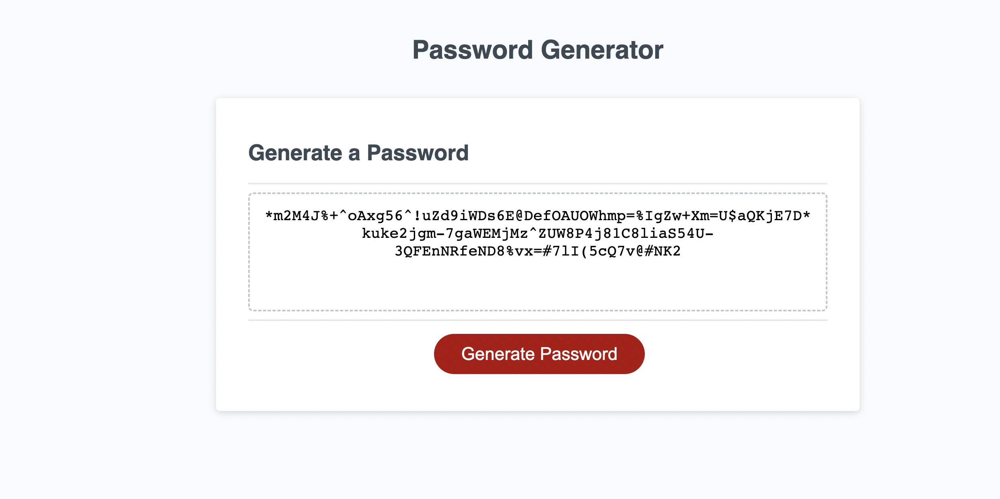
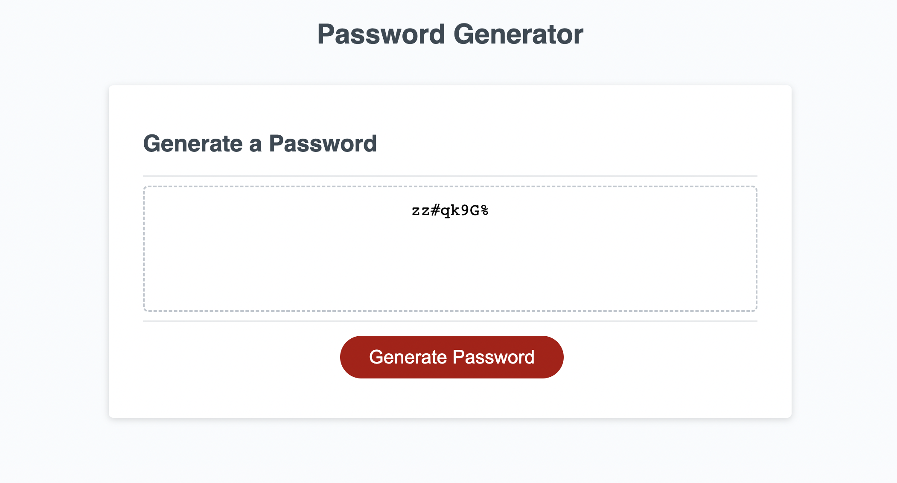
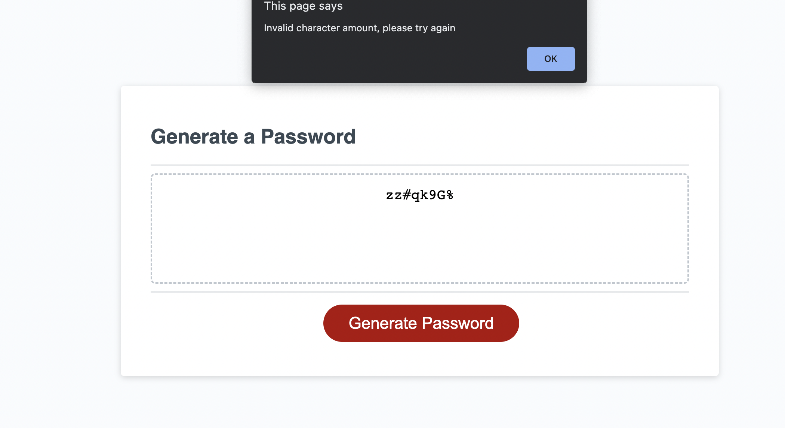

# Guess_mypassword

## WHAT I DID 
* To start off i needed to create a script.js file to be able to write my code.
* After that I needed to create a generate Button code to be able to have it show up on the client side or browser side.
* We needed to create a function, that allowed us create variables to prompt questions to be asked followed an array of options such as a long list of numbers or letters etc.
* Also added new things that we werent taught to my password generator like adding += to replace concat and shortend the array.

* Adding toLocaleUpperCase to add uppercase letters and that elimates a new array of upper case letters. So in end i was able to create 1 var with an array of letters and keep them lowercase.

* Once this is all done at the bottom you can create an event listener that will create the password once you click on the button generate password.

